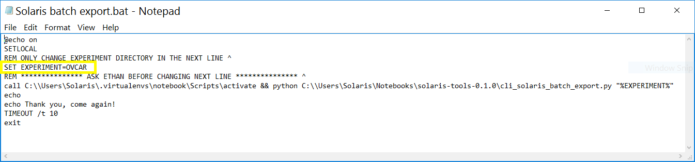
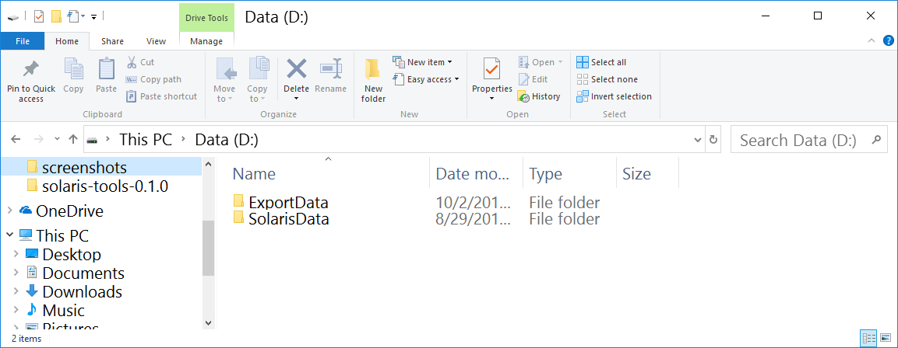
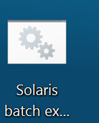
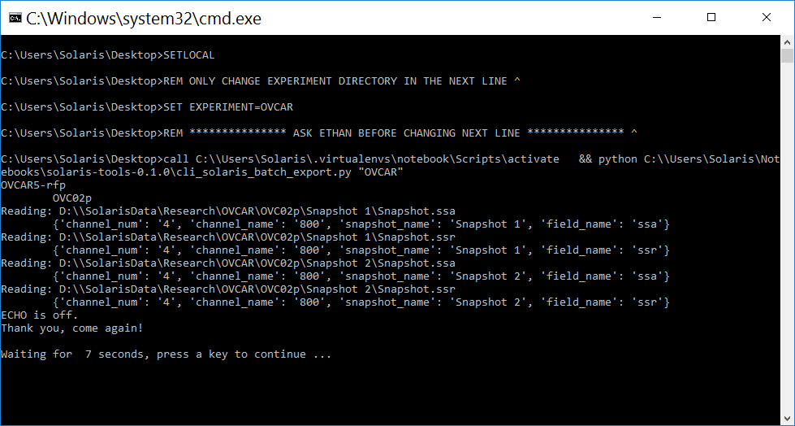
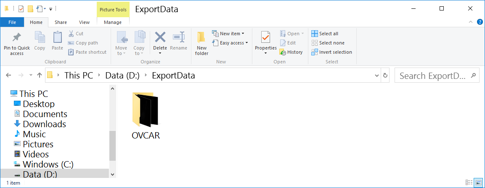

This is a Python3 script called by a Windows batch file. 
It was written using Python 3.4 and tested in Python 3.4 and 3.6
The batch file is intended to be run on the Solaris.

# Background
The Solaris software does not have capability to export full bitdepth (16-bit) images to image files.  It converts them to 8-bit RGB images, forcing the user to either: 1) analyze images that have far inferior dynamic range than the originally acquired images, or 2) use the rudimentary image analysis tools on the Solaris Analysis software to analyze full bitdepth 16-bit images.  Both of these options are sub-optimal.  Moreover, the Solaris software requires the user to export each image individually - a tediously mind-numbing exercise that is an incredible waste of skilled full-time employee resources.  Ideally, we would like to batch export images at full bitdepth and use third-party software, such as NIH ImageJ, to analyze the images, which would enable the use of sophisticated techniques like thresholding, determining area, or determining integrated density. 

### Using CLI Solaris Batch Export
* **TLDR: Edit .bat file with experiment name**

* [Follow installation documentation for Windows](../README.md)
* Right click .bat file and edit contents to specific experiment directory
  * The Python file assumes certain locations  for input and output directories are in place:
    * Input directory: D:\\\\SolarisData\\Research\\
    * Output directory: D:\\\\ExportData
    

* Run the .bat file by double clicking.

* A command window will show progress.

* Check output directory for new folder

* Enjoy .TIF images
